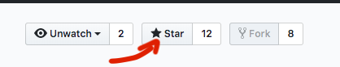

# kgs - Kubernetes Getting Started

---

## Course Description:
This course provides a walkthrough of the basics of the Kubernetes cluster orchestration system. Each sections contains a major Kubernetes concept and exercises. 

## Course Content:
 - Introduction to cluster systems
 - Kubernetes architecture
 - Basic Deployment objects
   - Pod 
   - ReplicaSet
   - Deployment
   - Service
   - Namespace
 - First kubectl commands
   - Create a Pod - Display logs - Execute a command inside a Pod
   - Create a Deployment - Deployment logs - label selector
   - Deployment - Self-healing and Scalability 
   - Create a Pod with yml file
   - Imperative vs Declarative approach
 - Kubernetes object definition file - yaml
   - Pod definition file
   - ReplicaSet definition file
   - Deployment definition file
   - Generate a Kubernetes object definition file - dry-run
 - Kubernetes Services
   - ClusterIP Service
   - NodePort Service
   - LoadBalancer Service
 - Inject Data Into Applications
   - Define a Command and Arguments for a Container
   - Define an environment variable for a container
   - ConfigMap
   - Secrets
 - Choosing the Right Container Infrastructure 
 - Helm Getting Started

--- 
## Course Slides:
 - [Slides](https://gerassimos.github.io/kgs/index.html)

---
## Course Exercises and Hands-on Labs:
 - [Exercises and Hands-on Labs](https://github.com/gerassimos/kgs/tree/main/exercises)

---
## Prerequisites:
- No paid software required
- Linux basics such as shell terminal, text editing from the command (vim, nano)
- Understand the basics of web and database servers (how they typically communicate, IP's, ports etc.)
- Have a GitHub and Katacoda account

---

 - If you found this repository to be helpful, you can say "like" by clicking the "Star" button. Thanks :)
 

 
 