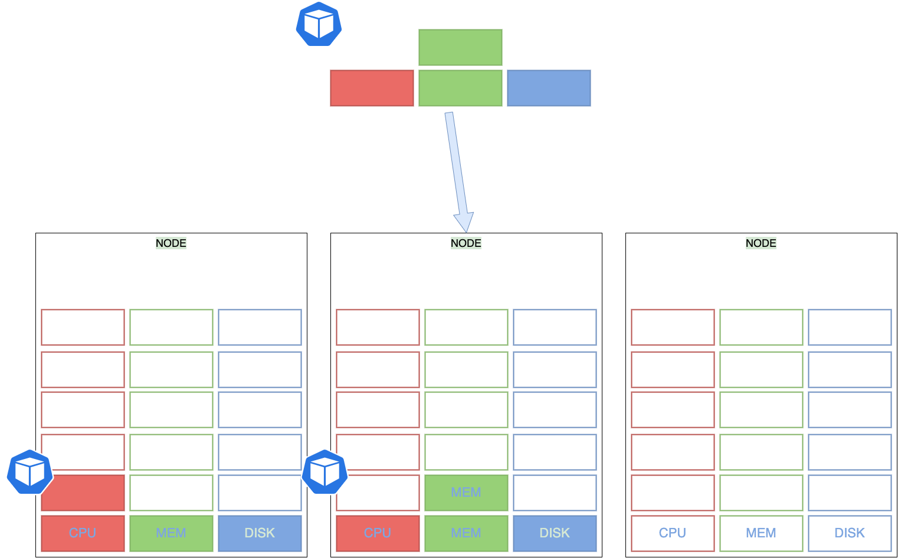
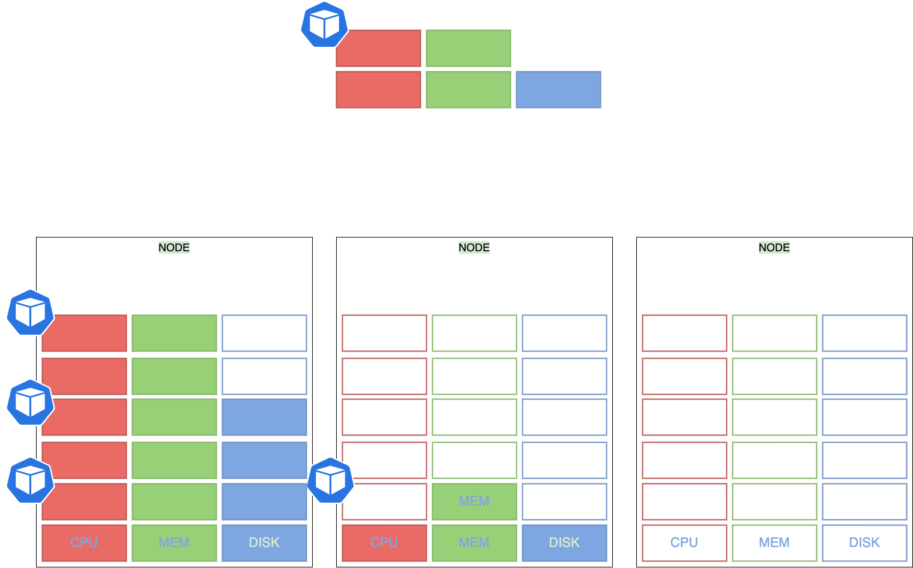

class: center, middle
# Section 10  
## Resource Requests and Limits  

---
## Resource Requests - Example 

---

## Resource Requests - Example 
 - Let us look at a 3 Node Kubernetes cluster. 
 - Each node has a set of CPU, Memory and Disk resources available. 
 - Every POD consumes a set of resources. 
 - In this case 2 CPUs , one Memory and some disk space. 
 - Whenever a POD is placed on a Node, it consumes resources available to that node.  

---
## Resource Requests - Example

---
## Resource Requests - Example
 - It is the `kubernetes scheduler` that decides which Node a POD goes to. 
 - The scheduler takes into consideration, the amount of resources **required** by a POD and those **available** on the Nodes. 
 - In this case, the scheduler schedules a new POD on Node 2.  
---
## Resource Requests - Example

---
## Resource Requests - Example
 - If the node has no sufficient resources, the scheduler avoids placing the POD on that node...
 - The **Kubernetes scheduler** is playing `tetris` with resources 
   - Node available resources and POD requested resources 
---
## Resource Requests - pod.yaml
- TODO
---
## Resource Limits
 - TODO