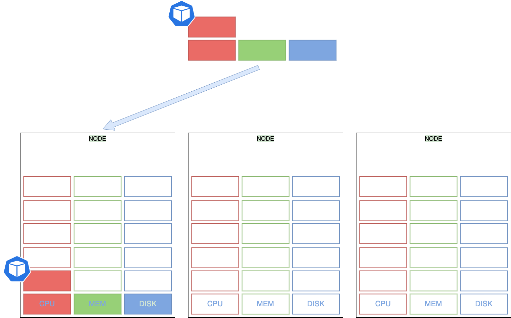

class: center, middle
# Section 10  
## Resource Requests and Limits  

---
## Resource Requests - Example

---
## Resource Requests - Example 

---

## Resource Requests - Example 
 - Let us look at a 3 Node Kubernetes cluster. 
 - Each node has a set of CPU, Memory and Disk resources available. 
 - Every POD consumes a set of resources. 
 - In this case 2 CPUs , one Memory and some disk space. 
 - Whenever a POD is placed on a Node, it consumes resources available to that node.  

---
## Resource Requests - Example


---
## Resource Requests - Example
 - It is the `kubernetes scheduler` that decides which Node a POD goes to. 
 - The scheduler takes into consideration, the amount of resources **required** by a POD and those **available** on the Nodes. 
 - In this case, the scheduler schedules a new POD on Node 2.  
---
## Resource Requests - Example

---
## Resource Requests - Example
 - If the node has no sufficient resources, the scheduler avoids placing the POD on that node...
 - The **Kubernetes scheduler** is playing `tetris` with resources 
  
---
## Resource Requests - pending state

---

## Resource Requests - pending state
 - If there is no sufficient resources available on any of the nodes 
 - Kubernetes holds back scheduling the POD, and we will see the POD in a pending state. 
 - If we look at the events, you will see the reason  

```console
kubectl describe pod <my-pod>
...
Events:
  ...  Reason            Message
       ------            -------
  ...  FailedScheduling  No nodes are available that match all of the following predicates:: Insufficient memory (3).

```

---

## Resource Requests - default 
 - By default, kubernetes assumes that a POD or a container within a POD requires 
 - `0.5` **CPU** 
 - `256` Mebibyte of **memory**
---
## Resource Requests - pod.yaml
 - If we know that your application will need more than these, we can modify these values, by specifying them in our POD yaml definition file.
   - 
---
## Resource - CPU unit

---
## Resource - CPU unit
 - What does 1 count of CPU really mean? 
 - You can specify any value as low as 0.1. 
 - 0.1 CPU can also be expressed as 100m were m stands for milli. 
 - We can go as low as 1m, but not lower than that. 
 - 1 count of CPU is equivalent to 1 vCPU. 
 - That’s 1 vCPU in AWS, or 1 Core in GCP or Azure or 1 Hyperthread. 
---
## Resource - Memory unit

---
## Resource - Memory unit
 - The memory resource is measured in bytes
 - we can express memory with one of these suffixes: 
   - G, M, K        
   - Gi, Mi, Ki
 - `1K => 1000 bytes`
 - `1Ki => 1024 bytes`
---

## Resource Limits
 - TODO