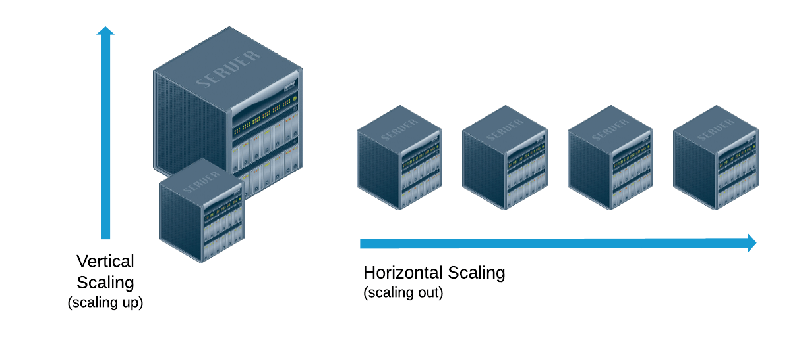
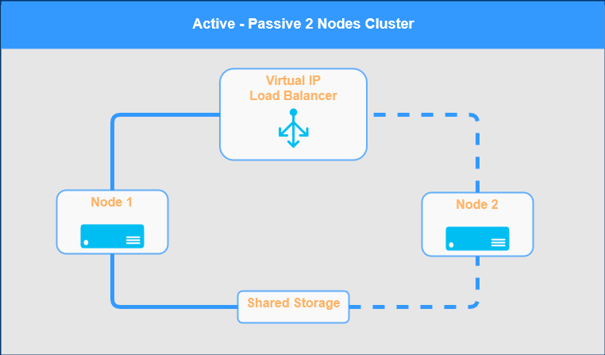
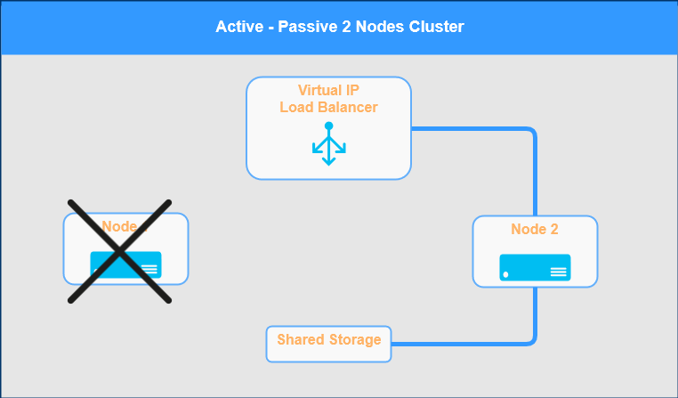
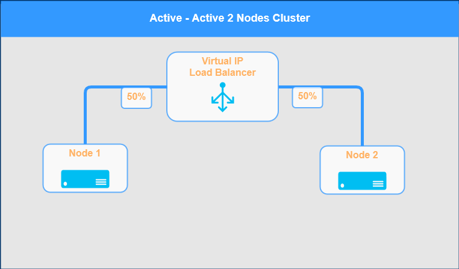
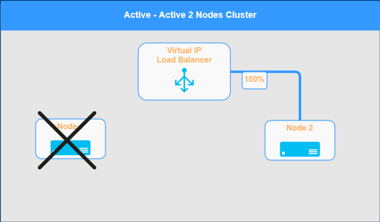
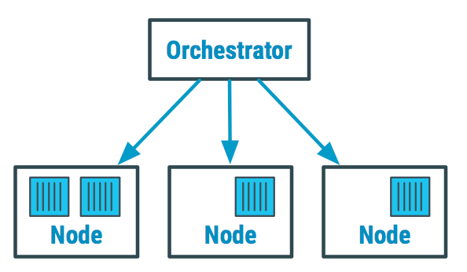
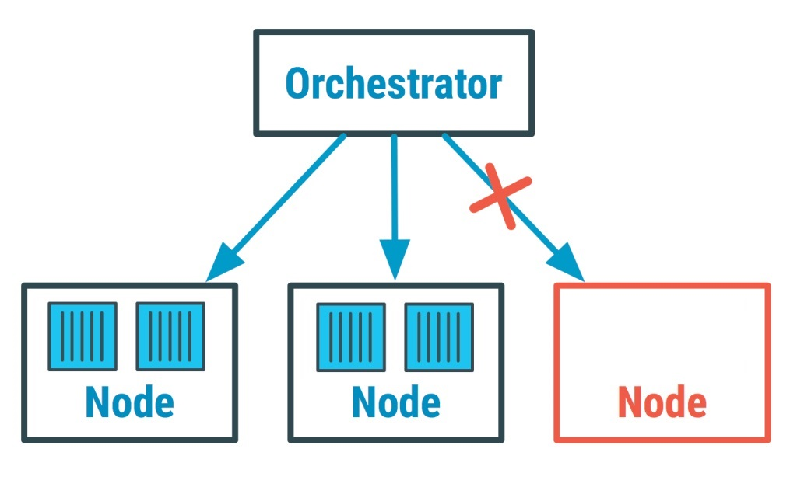

class: center, middle
# Section 1 - Introduction To Cluster Systems

---

## Computer cluster (1)
 - A computer **cluster** is a set of connected computers **(nodes)** that work together so that, in many respects, they can be viewed as a single system 
 - The components of a cluster are usually connected to each other through **fast local area networks** 
 - In some circumstances, all the nodes of a cluster use the same hardware and **the same OS**  

---

## Computer cluster (2)
 - Clusters are deployed to improve **availability** and **performance** over that of a single computer
    - **High availability (HA)** => Recover from failures (fault tolerance) 
    - **Horizontal Scaling** => distribute the load across multiple replicated services
    

>Ref: [wiki](https://en.wikipedia.org/wiki/Computer_cluster)

---

## Active/Passive Cluster (1)

---

## Active/Passive Cluster (2)

---

## Active/Active Cluster (1)

 
---
 
## Active/Active Cluster (2)

 
---

## List of cluster management software
 - Docker Swarm
 - Kubernetes
 - Apache Mesos
 - Red Hat cluster suite
 - Heartbeat, from Linux-HA
 - Nomad, from HashiCorp
 - Service Fabric, from Microsoft

Ref: [wiki](https://en.wikipedia.org/wiki/List_of_cluster_management_software)

---

## Container Orchestrator (1)
 - A Container Orchestrator is a clustering solution
 - It has a set of tools that are designed to easily **manage** complex **container deployments** across **multiple nodes** from one central location. 
 - This includes:
    - The containers themselves 
    - The hosts 
    - The virtual networking
    - The storage 
    - etc…
    
---

## Container Orchestrator (1a)

---

## Container Orchestrator (1b)

---
## Container Orchestrator (2)    
 - Well known container orchestrators that are on the market today are:
    - Kubernetes 
    - Docker Swarm 
    - Mesos/Marathon 
    - ...
 - The **most popular** Container Orchestration solutions are 
    - **Kubernetes**  
    - **Docker Swarm**  

 

