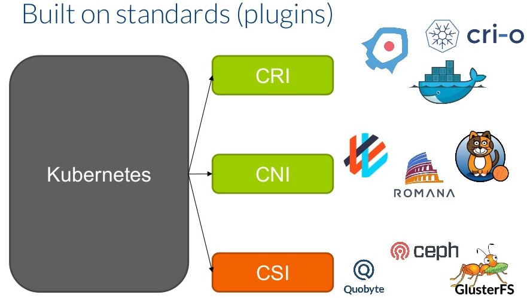

# 1 - Kubernetes architecture 
---

## Simple Kubernetes Diagram (1)
 - 
 
## Node types 
 - Master Nodes => run the control plane components
 - Worker Nodes => run application workloads
 
 
## Master Nodes - control plane components
 - The control plane is the brain and heart of Kubernetes
 - Kubernetes components that control the cluster
 - Manages the worker `Nodes` and the `Pods` in the cluster
 - Can run also application workloads
 - However, a best practice is not to deploy application workloads on a master nodes

## control plane - kube-apiserver
 - It is at the center of all Control Plane Components
 - The kube-apiserver exposes the Kubernetes REST API (http endpoints)
 - It is used by external clients such as the kubectl

## control plane - etcd
 - Is the Database used to store information in a key-value format
 - 
 
## control plane - kube-scheduler
 - identifies the right node to place a container based on container's resource requirements 
 - The kube-scheduler goes over 2 phases
   1. Filter out the nodes that does not fit (e.g not enough cpu)
   2. Ranks the nodes to identify the best fit
 - 
 - 

## control plane - kube-controller
 - The kube-controller continuously monitor the state of the various deployment components and works towards bringing the whole system  to the desired state
 - Example the replication-controller check that the desired number of PODs are available
 
## control plane components running as pods
 - There are 2 types of kubernetes deployments 
   1. The "hard way" from scratch 
   2. Via the kubeadm tool
 
 1. The "hard way" => all control plan components are running as linux services 
 2. Via the kubeadm tool => all control plan components are running as "static" PODs 
 
## kubelet
 - Is a linux service running each node of the cluster
 - Listen for instructions from the kube-apiserver
 - When receives instruction to create a POD => send the request to the container run time such as Docker to pull the images and create the containers 
--- 
## kube-proxy
 - The kube-proxy is a process that runs on each node of the cluster (can be deployed as a DaemonSet)
 - Every time a new service is created it creates the appropriate iptables rules
--- 
## kubectl (1)
 - It is the main cli tool to manage the kubernetes cluster
 - kubectl is a client for the Kubernetes API (kube-apiserver)
 - The Kubernetes API is an http Rest API
 - Kubernetes is fully controlled through this API
 - 

## kubectl (2)
### `kubectl get nodes`
```
# kubectl get nodes
NAME     STATUS   ROLES                  AGE   VERSION
gm-121   Ready    control-plane,master   53d   v1.20.2
gm-122   Ready    <none>                 53d   v1.20.2
gm-123   Ready    <none>                 53d   v1.20.2
```
---

## kubernetes plugins CRI|CNI|CSI 
### `CRI` = Container Runtime Interface
### `CNI` = Container Network Interface
### `CSI` = Container Storage Interface 

---

## Basic Deployment objects
### `Pod` -> The smallest deployable unit
### `ReplicaSet` -> Used to provide self-healing and scaling
### `Deployment` -> Used to provide zero-downtime rolling-updates
### `Service`    -> Provide stable reliable networking for Pods (cannot relay on Pod IP)
### `Namespace`  -> logically divide the cluster in multiple virtual clusters
---

## Basic Deployment objects - Deployment 
 - 
 - A pod is managed by a ReplicaSet which is managed by a Deployment
---

## Pod 
 - Pod is the smallest deployable unit
 - At high level a container is wrapped in a Pod so it can run on kubernetes
 - pod do not serf-heal and the do not scale
 - pod do not support easy updates and rollbacks (undo the update) 

--- 
## Multi-container Pod 
 - We can have more that one container in Pod
 - Containers deployed in a Pod are always co-located 
 - They share the same network stack and volumes
 

## ReplicaSet - self-healing and scalability
 - If a Pod managed be a ReplicaSet fails, it will be replaced **(self-healing)**
 - We can easily increase or decrease the number of Pods **(scaling)** 
 - It is common not to create ReplicaSet directly but use Deployment to manage the ReplicaSet
---

## Deployment
 - Used to provide zero-downtime rolling-updates
 - Every time that we create a Deployment we automatically get a ReplicaSet that manages the Deployment's Pods
 - It important to understand that a single Deployment object can only manage a **single** Pod template  
---

## Namespace
 - logically divide the cluster in multiple virtual clusters
 - Example: we can have namespace for the `prod` environment and one for the `test` environment
 - Example: we can have a namespace to separate independent application stacks
 - `kube-system` namespace is used for the control plane applications
 - `default` namespace is used for our workloads
 - Not All Objects are in a Namespace


