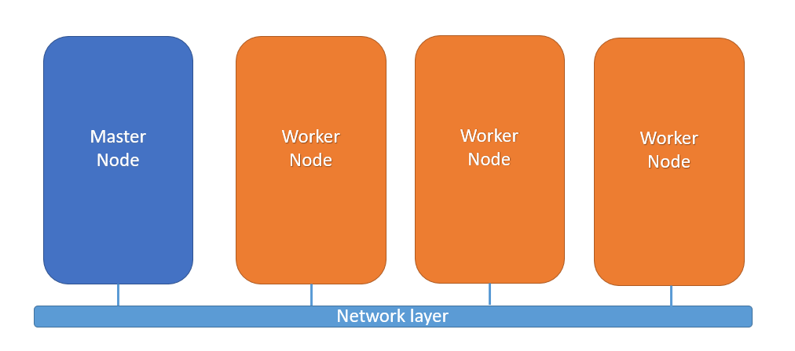
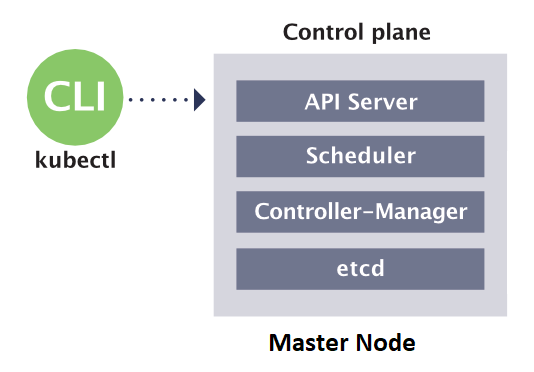
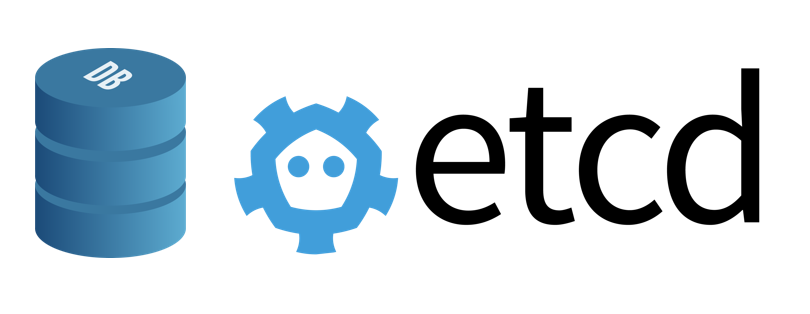
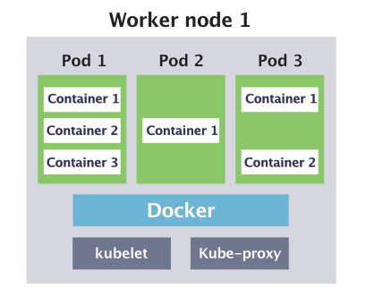
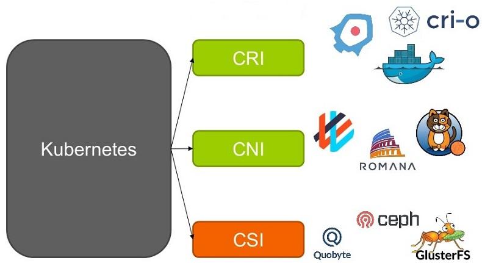

class: center, middle
# Section 2 - 
## Kubernetes architecture
---
background-image: url(images/Kubernetes_20architecture_20diagram_b.png)
background-size: 100% 100%
---
## Node types 
 - `Master Nodes` => run the **control plane** components
 - `Worker Nodes` => run **application workloads**
 
<p style="text-align: center;">
  
</p>
  
---
## Master Nodes - control plane components
 - The control plane is the **brain** and heart of Kubernetes
 - Kubernetes components that control the cluster
 - Manages the **Worker Nodes** and the **Pods** in the cluster
 - Can also run **application workloads**
 - However, a best practice is **not** to deploy application workloads on a master nodes
---
## control plane - kube-apiserver
 - It is at the center of all Control Plane Components
 - The kube-apiserver exposes the Kubernetes `REST API` *(http endpoints)*
 - It is used by external clients such as the `kubectl`

---
## control plane - etcd
 - Is the **Database** used to store information in a **key-value** format
   
<p style="text-align: center;">
  
</p>

---
## control plane - kube-scheduler
 - identifies the right node to place a container based on container's resource requirements 
 - The `kube-scheduler` goes over 2 phases:
   1. **Filter out** the nodes that does not fit (e.g not enough cpu)
   2. **Ranks the nodes** to identify the best fit

<p style="text-align: center;">
  
</p>


 
---
## control plane - kube-controller-manager
 - The **kube-controller-manager** continuously monitor the state of the various deployment components and works towards bringing the whole system  to the desired state
 - Example the **replication-controller** check that the desired number of PODs are available
<p style="text-align: center;">
  
</p>

---
## kubelet
 - Is a **linux service** running each node of the cluster
 - Listen for instructions from the **kube-apiserver**
 - When receives instruction to create a POD => send the request to the **container run** time such as Docker to pull the images and create the containers
<p style="text-align: center;">
  
</p>

---
## kube-proxy
 - The **kube-proxy** is a process that runs on each node of the cluster (can be deployed as a DaemonSet)
 - Every time a new service is created it creates the appropriate **iptables rules**
<p style="text-align: center;">
  
</p>

---
## kubectl (1)
 - It is the main cli tool to manage the kubernetes cluster
 - `kubectl` is a client for the Kubernetes API (kube-apiserver)
 - The Kubernetes API is an http Rest API
 - Kubernetes is fully controlled through this API
<p style="text-align: center;">
  
</p>

---
## kubectl (2)
### `kubectl get nodes`
```console
# kubectl get nodes
NAME     STATUS   ROLES                  AGE   VERSION
gm-121   Ready    control-plane,master   53d   v1.20.2
gm-122   Ready    <none>                 53d   v1.20.2
gm-123   Ready    <none>                 53d   v1.20.2
```
---
## kubernetes plugins CRI|CNI|CSI 
 - `CRI` = Container Runtime Interface
 - `CNI` = Container Network Interface
 - `CSI` = Container Storage Interface  

<p style="text-align: center;">
  
</p>
---
## Kubernetes installation options  
 - There are many types of kubernetes installation methods 
   1. The **hard way** from scratch 
   2. Via the **kubeadm** tool
   3. Via a Cloud provider (AWS EKS etc.)

1. The **hard way** => all control plan components are running as **linux services**
2. Via the **kubeadm** tool => all control plan components are running as "static" **PODs**
3. Via a Cloud provider => All control plan components are manages from the cloud vendor. We have access only to the workers nodes We do not manage
---
## kubernetes Installation options for Dev
 - Docker Desktop (Enable Kubernetes)
 - Minikube (--driver=virtualbox)
 - MicroK8s (Canonical - Ubuntu)
 - K3S (Lightweight Kubernetes - Rancher)
 - Play with kubernetes (online web based)
 - killercoda (online web based)


