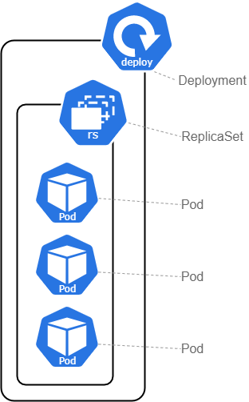

class: center, middle
# Section 3  
## Basic Deployment objects  

---

## Basic Deployment objects
 - `Pod` -> The smallest deployable unit
 - `ReplicaSet` -> Used to provide **self-healing** and **scaling**
 - `Deployment` -> Used to provide zero-downtime **rolling-updates**
 - `Service`    -> Provide stable **reliable networking** for Pods (cannot relay on Pod IP)
 - `Namespace`  -> **logically divide** the cluster in multiple virtual clusters
   
   

---

## Basic Deployment objects - Deployment 
<table style="width:100%">
  <tr>
    <td>A <b>Pod</b> is managed by a <b>ReplicaSet</b> which is managed by a <b>Deployment</b></td>
    <td></td>
  </tr>
</table>  

---

## Pod 
 - With Kubernetes our ultimate aim is to deploy our application in the form of containers on a set of machines that are configured as worker nodes in a cluster.
 - However, it is does not deploy containers directly on the worker notes.
 - The containers are encapsulated into a kubernetes object known as pods.

## Pod 
 - Pod is the smallest deployable unit
 - At high level a container is wrapped in a Pod so it can run on kubernetes
 - pod do not serf-heal and the do not scale
 - pod do not support easy updates and rollbacks (undo the update) 

--- 

## ReplicaSet - self-healing and scalability
 - If a Pod managed be a ReplicaSet fails, it will be replaced **(self-healing)**
 - We can easily increase the number of Pods **(scaling)** to handle more load (static site example)
 - It is common not to create ReplicaSet directly but use Deployment to manage the ReplicaSet
 
---

## Deployment
 - Used to provide zero-downtime rolling-updates
 - Every time that we create a Deployment we automatically get a ReplicaSet that manages the Deployment's Pods
 - It important to understand that a Deployment object can only manage a **single** Pod template  
---

## Multi-container Pod 
 - We can have more that one container in Pod
 - Containers deployed in a Pod are always co-located 
 - They share the same network stack and volumes
 

## Namespace
 - It is used to logically divide the cluster in multiple virtual clusters
 - For example we can have namespace for the `prod` environment and one for the `test` environment
 - For example we can have a namespace to separate independent application stacks
 - `kube-system` namespace is used for the control plane applications
 - `default` namespace is used for our workloads

 > Note:  
 > Not All kubernetes objects are in a `namespace`
