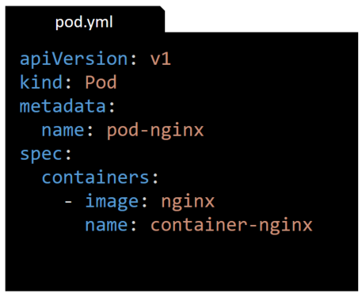

class: center, middle
# Section 4  
## First kubectl commands  

---
## Common commands (pods)
 - `kubectl run` - create a pod
 - `kubectl get` - list resources.
 - `kubectl describe` - show detailed information about a resource.
 - `kubectl logs` - print the logs from a container in a pod.
 - `kubectl exec` - execute a command on a container in a pod.
 - `kubectl delete` - delete a resource.
[reference](https://kubernetes.io/docs/reference/kubectl/cheatsheet/)

---

## kubectl run - create a pod

 - `kubectl run <pod-name> --image=<docker-image>`
```console
# kubectl run nginx --image=nginx
pod/nginx created
```

 - `kubectl get <resource-type>`
```console
# kubectl get pods
NAME    READY   STATUS    RESTARTS   AGE
nginx   1/1     Running   0          6m42s
```
---

## kubectl describe - show detailed information  
 - `kubectl describe <resource-type> <resource-name>`

```console
# kubectl describe pod nginx
Name:         nginx
Namespace:    default
Priority:     0
Node:         node01/172.17.0.36
Start Time:   Sat, 10 Apr 2021 16:35:09 +0000
Labels:       run=nginx
Annotations:  <none>
Status:       Running
IP:           10.244.1.3
IPs:
  IP:  10.244.1.3
Containers:
  nginx:
    Container ID:   docker://9a3f5f0fa4331838c93390a75413c0ad140138a0a7b9f047920e68a197f0ef51
    Image:          nginx
...
    State:          Running
...
```
> Note
> See info about Namespace, Node, **Labels** etc..

---
## kubectl describe - show detailed information (1)
```console
# kubectl describe pod nginx
Name:         nginx
...
Containers:
  nginx:
    Container ID:   docker://9a3f5f0fa4331838c93390a75413c0ad140138a0a7b9f047920e68a197f0ef51
    
... 
Volumes:
...
Events:
  Type    Reason     Age   From               Message
  ----    ------     ----  ----               -------
  Normal  Scheduled  10m   default-scheduler  Successfully assigned default/nginx to node01
  Normal  Pulling    10m   kubelet, node01    Pulling image "nginx"
  Normal  Pulled     10m   kubelet, node01    Successfully pulled image "nginx"
  Normal  Created    10m   kubelet, node01    Created container nginx
  Normal  Started    10m   kubelet, node01    Started container nginx
```

---

## kubectl logs - display logs
### `kubectl logs <pod-name> [container-name]`
```console
# kubectl logs nginx nginx
/docker-entrypoint.sh: /docker-entrypoint.d/ is not empty, will attempt to perform configuration
/docker-entrypoint.sh: Looking for shell scripts in /docker-entrypoint.d/
/docker-entrypoint.sh: Launching /docker-entrypoint.d/10-listen-on-ipv6-by-default.sh
10-listen-on-ipv6-by-default.sh: info: Getting the checksum of /etc/nginx/conf.d/default.conf
...

# kubectl logs nginx 
...
```

---

## kubectl exec - execute a command 
### `kubectl exec -it <pod-name> [container-name] -- <cmd>`
```console
# kubectl exec -it nginx -- sh
root@nginx:/# ...
root@nginx:/# exit
# 
```
> Note 
> The `-it` option is used to create a terminal and attache it to the pod.
> We are inside the container now, we need to type `exit` to return to the node terminal

```console
# kubectl exec nginx -- sh -c "env"
...
NGINX_VERSION=1.19.9
...
```

> Note 
> The command is execute in the container and the output is displayed in the node.
> We are NOT inside the container

---

## kubectl delete - delete a resource
 - `kubectl delete <resource-type> nginx`
```console
# kubectl delete pod nginx
pod "nginx" deleted
```

---
class: center, middle
# Section 4  
## First kubectl commands - deployment

---

## Common commands (deployment)
 - `kubectl create deployment`  
 - `kubectl get all` - list all resources in the current (default) namespace
 - `kubectl scale deployment` - Scaling a Deployment 
 - `kubectl delete deployment nginx-deploy` 

---

## kubectl create deployment
 - `kubectl create deployment <deployment-name> --image=<docker-image>`
```console
# kubectl create deployment nginx-deploy --image=nginx
deployment.apps/nginx-deploy created
```

---
## List all resources in a namespace
 - `$ kubectl get all --namespace=<namespace-name>`

```console
$ kubectl get all
NAME                               READY   STATUS    RESTARTS   AGE
pod/nginx-deploy-d4789f999-vgmw4   1/1     Running   0          3m26s

NAME                 TYPE        CLUSTER-IP   EXTERNAL-IP   PORT(S)   AGE
service/kubernetes   ClusterIP   10.96.0.1    <none>        443/TCP   11m

NAME                           READY   UP-TO-DATE   AVAILABLE   AGE
deployment.apps/nginx-deploy   1/1     1            1           3m26s

NAME                                     DESIRED   CURRENT   READY   AGE
replicaset.apps/nginx-deploy-d4789f999   1         1         1       3m26s
```

> Notes:  
> From the output of the above command we can see the layers of a Deployment object (Deployment->ReplicaSet->Pod)
> If we omit the `--namespace` option then the **default** namespace is used  
> The **kubernetes** service in the default namespace is a service which forwards requests to the Kubernetes-api server. 
> So all the requests to the **kubernetes.default** dns-name will be routed to the Kubernetes-api server
---

## Delete the pod that is part of Deployment (self-healing)
 - If we try to Delete a Pod which is part of Deployment then a new Pod is created (**self-healing**).  

```console
# kubectl delete pod nginx-deploy-d4789f999-vgmw4
pod "nginx-deploy-d4789f999-vgmw4" deleted

# kubectl get all
NAME                               READY   STATUS    RESTARTS   AGE
pod/nginx-deploy-d4789f999-t7r2c   1/1     Running   0          27s

NAME                 TYPE        CLUSTER-IP   EXTERNAL-IP   PORT(S)   AGE
service/kubernetes   ClusterIP   10.96.0.1    <none>        443/TCP   62m

NAME                           READY   UP-TO-DATE   AVAILABLE   AGE
deployment.apps/nginx-deploy   1/1     1            1           53m

NAME                                     DESIRED   CURRENT   READY   AGE
replicaset.apps/nginx-deploy-d4789f999   1         1         1       53m
```

---

## Scaling a Deployment (1)
 - `kubectl scale  deployment <deployment-name> --replicas=<number-of-replicas>`
---
## Scaling a Deployment (2)
 - Use deployment
```console
# kubectl scale  deployment nginx-deploy --replicas=3
deployment.apps/nginx-deploy scaled
```
 - Use deploy instead of deployment
```console
# kubectl scale  deploy nginx-deploy --replicas=3
deployment.apps/nginx-deploy scaled
```
 - Use "/" instead of a space
```console
# kubectl scale deploy/nginx-deploy --replicas=3
deployment.apps/nginx-deploy scaled
```
---
## Scaling a Deployment (3)
 - There are **multiple ways** to execute the same command.
 - There are **multiple ways** to create objects and perform any kind of administrative action on kubernetes
 - Resource types and their abbreviated aliases - [Resource Types](https://kubernetes.io/docs/reference/kubectl/overview/#resource-types)
---
## Scaling a Deployment (4)
 - After the scale => List all resources in a namespace

```console
# kubectl get all
NAME                               READY   STATUS    RESTARTS   AGE
pod/nginx-deploy-d4789f999-t7r2c   1/1     Running   0          31s
pod/nginx-deploy-d4789f999-dzc97   1/1     Running   0          17s
pod/nginx-deploy-d4789f999-bsc13   1/1     Running   0          17s

NAME                 TYPE        CLUSTER-IP   EXTERNAL-IP   PORT(S)   AGE
service/kubernetes   ClusterIP   10.96.0.1    <none>        443/TCP   3m57s

NAME                           READY   UP-TO-DATE   AVAILABLE   AGE
deployment.apps/nginx-deploy   3/3     3            3           36s

NAME                                     DESIRED   CURRENT   READY   AGE
replicaset.apps/nginx-deploy-d4789f999   3         3         3       31s
```

---

## Deployment logs 
 - To see the deployment logs:
```console
# kubectl logs deployment/nginx-deploy
Found 3 pods, using pod/nginx-deploy-d4789f999-t7r2c
/docker-entrypoint.sh: /docker-entrypoint.d/ is not empty, will attempt to perform configuration
/docker-entrypoint.sh: Looking for shell scripts in /docker-entrypoint.d/
``` 

> This will only display logs from one pod 

---
## Deployment logs - label selector (1)
 - Use the `kubectl get pod --show-labels` command to display pod labels

```console
$ kubectl get pod --show-labels
NAME                           READY   STATUS    RESTARTS   AGE     LABELS
nginx-deploy-d4789f999-t7r2c   1/1     Running   0          8m22s   app=nginx-deploy
nginx-deploy-d4789f999-dzc97   1/1     Running   0          21m     app=nginx-deploy
nginx-deploy-d4789f999-x6vxb   1/1     Running   0          24m     app=nginx-deploy
```

---
## Deployment logs - label selector (2)

 - Use the `kubectl logs -l app=nginx-deploy` command to display logs from all Pods that are part of the Deployment 
 - This command is using the **label selector** `-l app=nginx-deploy` to filter the set of pods and apply the logs command 
```console
$ kubectl logs -l app=nginx-deploy
/docker-entrypoint.sh: /docker-entrypoint.d/ is not empty, will attempt to perform configuration
/docker-entrypoint.sh: Looking for shell scripts in /docker-entrypoint.d/
...
/docker-entrypoint.sh: /docker-entrypoint.d/ is not empty, will attempt to perform configuration
/docker-entrypoint.sh: Looking for shell scripts in /docker-entrypoint.d/
...
/docker-entrypoint.sh: /docker-entrypoint.d/ is not empty, will attempt to perform configuration
/docker-entrypoint.sh: Looking for shell scripts in /docker-entrypoint.d/
``` 

> Usually in production we use 3rd party logging solutions such as the **ELK Stack** (Elasticsearch, Logstash, and Kibana) 
---

## Delete the deployment
 - Use the `kubectl delete deployments <deployment-name>` to delete the deployment
```console
# kubectl delete deployments nginx-deploy 
deployment.apps "nginx-deploy" deleted
```
 - Display the available resources in the *default* namespaces:
```console
# kubectl get all
NAME                 TYPE        CLUSTER-IP   EXTERNAL-IP   PORT(S)   AGE
service/kubernetes   ClusterIP   10.96.0.1    <none>        443/TCP   53m
```

---
class: center, middle
# Section 4  
## First kubectl commands - yml  

---


## Create a pod with yml file - pod.yml
 - Following is the content of the [pod.yml](https://github.com/gerassimos/kgs/blob/main/resources/lectures/pod.yml) file used for this example  
   
   
> Both `.yml` and `.yaml` are valid extensions for the file
---

## Create a pod with yml file - kubectl create -f
### `kubectl create -f <file.yml>`  
```console
# kubectl create -f pod.yml 
pod/pod-nginx created

# kubectl get pods
NAME        READY   STATUS    RESTARTS   AGE
pod-nginx   1/1     Running   0          9s

# kubectl create -f pod.yml 
Error from server (AlreadyExists): error when creating "pod.yml": pods "pod-nginx" already exists

# kubectl delete pod pod-nginx 
pod "pod-nginx" deleted
```

> The second time that we execute the `kubectl create` command fails  

---


## Create a pod with yml file - kubectl apply -f

```console
# kubectl apply -f pod.yml 
pod/pod-nginx created

# kubectl get pods
NAME        READY   STATUS    RESTARTS   AGE
pod-nginx   1/1     Running   0          7s

# kubectl apply -f pod.yml 
pod/pod-nginx unchanged

# kubectl get pods
NAME        READY   STATUS    RESTARTS   AGE
pod-nginx   1/1     Running   0          18s
# 
```

> The second time that we execute the `kubectl apply` command succeed but nothing is changed in the cluster
> This is the `declarative` way of deploying a pod

---

## kubernetes Imperative vs Declarative (1)
 - There are two basic ways to deploy to Kubernetes: 
 1. **imperatively**: by using commands such as  
   - `kubectl run` or `kubectl create` etc..
 1. **declaratively**: by writing the manifest yaml files and using 
   - `kubectl apply -f app.yaml`.  
  
---
## kubernetes Imperative vs Declarative (2)
### With the `declarative` way 
 - if an object **does not exist** then is created
 - if an object **does exist** then is updated or remains unchanged

> Most of the times we use the `declarative` approach.  
> The yaml manifest files are treaded as code  
> which means that are stored in version control system such as GitHub