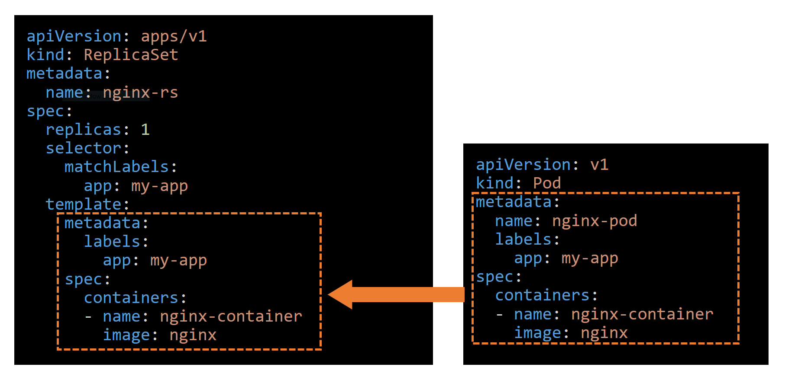
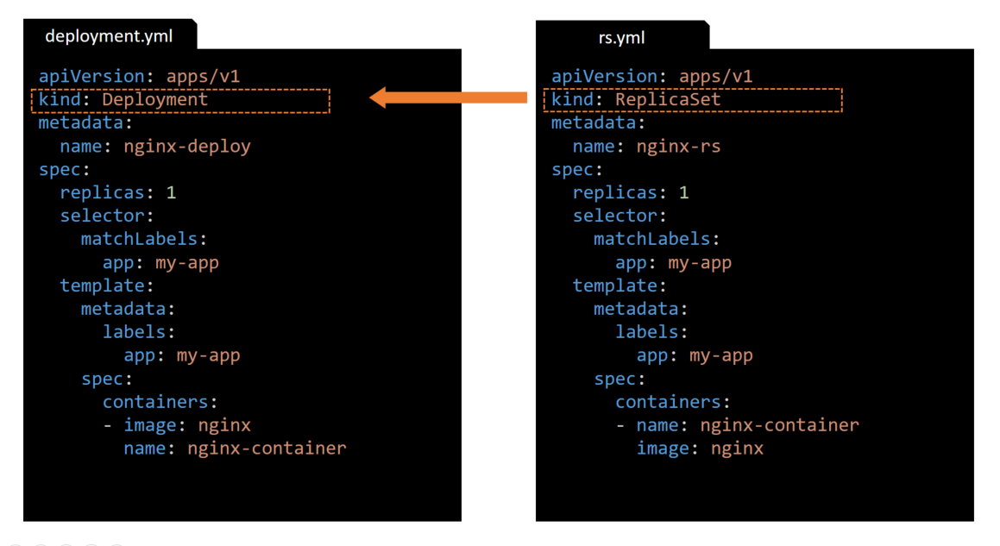
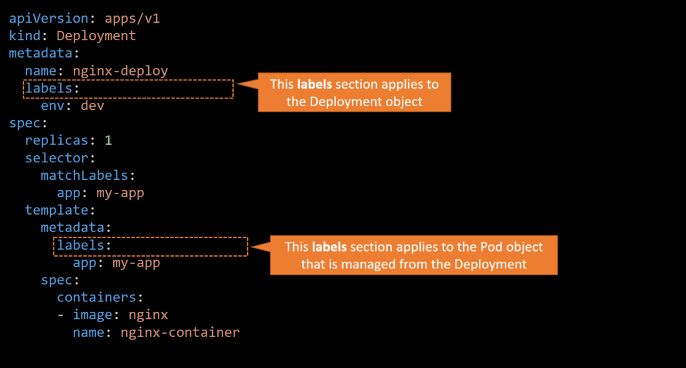
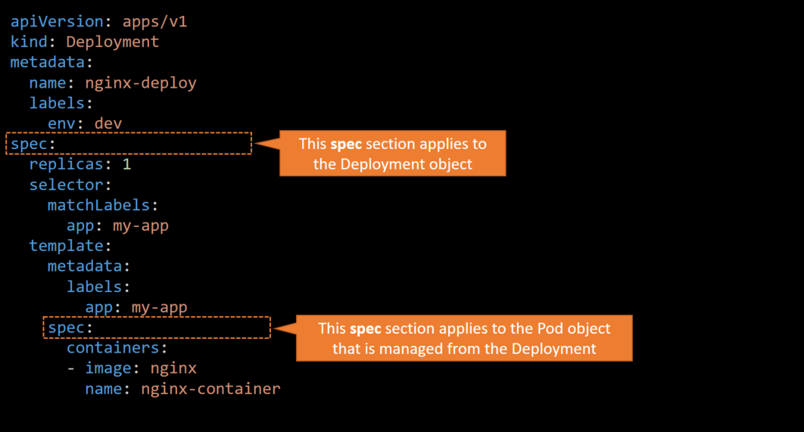

# Section 4 - Kubernetes object definition file - yaml
---

## The yaml file of a Kubernetes object
 - The yaml file of a Kubernetes object always contains the following fields (sections)
 - Both the `.yaml` and `.yml` are valid extensions for a Kubernetes definition file

```yaml  
apiVersion:  
kind:  
metadata:  
spec:  
```
### **apiVersion** = The version of the Kubernetes API used to create this object
### **kind** = What kind of object to create (Pod, ReplicaSet, Deployment etc.)
### **metadata** = Data that helps uniquely identify the object, including a `name` string, `labels` and optional `namespace`
### **spec** - The state/configuration of the object, (each object type has its own specification)

|kind         |apiVersion  |
|-------------|------------|
|Pod          |v1          |
|Service      |v1          |
|ReplicaSet   |apps/v1     |
|Deployment   |apps/v1     |

---

## Pod definition file (1) 
 - The following is an example of a `pod.yml` definition file
```yml
apiVersion: v1
kind: Pod
metadata:
  name: nginx-pod
  labels: 
    app: my-app
    env: production
    tier: frontend
spec:
  containers:
  - name: nginx-container
    image: nginx
```
> The value of the `apiVersion` is a **string** 
> The value of the `kind` is a **string** 
> The value of the `metadata` is a **dictionary** - (`name` and `labels` are siblings)
> Note that the number of spaces used for the indentation is very important, we must be consistent.
> In this example  `name` and `labels` are indented with 2 spaces
> The value of the `labels` is a ***dictionary** - (*dictionary* within a *dictionary*)

---

## Pod definition file (2) - containers section
 
```yml
...
spec:
  containers:
  - name: nginx-container
    image: nginx
```
> The value of the `spec` is a **dictionary** 
> The value of the `containers` is an **array**. The reason this property is an array is because a pod can have multiple containers.  
> In this case there is only one item in the array.  
> The item in the array is a dictionary with a **name** and **image** properties
> The **-** right before the **name** indicates that this is the first item in the list.
  
---

## Pod definition file - Multi-container Pod
```yml
...
spec:
  containers:
  - name: nginx-container
    image: nginx
  - name: log-shipper
    image: alpine
```
> In this case the **containers** value is an array with 2 items related to to different containers (nginx-container and log-shipper)
> This example of a multi-container pod is known as the **sidecar** pattern 

### To create the pod execute:  
### `kubectl apply -f pod.yml`  


## ReplicaSet definition file (1)
 - The following is an example of a `rs.yml` definition file
 - As with any Kubernetes yaml definition file there are 4 sections 
 
```yaml  
apiVersion: apps/v1
kind: ReplicaSet
metadata:
  name: nginx-rs
spec:
  replicas:
  selector:
  template:
```
> The spec section:   
> **replicas** = The the number of desired replicas. Remember a ReplicaSet creates multiple instances of a **Pod**  
> **selector** = Used as a glue to determine which Pod are managed from the ReplicaSet  
> **template** = Used for the Pod definition 

---

## ReplicaSet definition file (2)


---

## ReplicaSet definition file (3)

> But why we need a **selector** since the **template** section already contains the Pod managed from the ReplicaSet?  
> Because can also manage Pods (of the same type) that are not created part of the ReplicaSet,
> Pods that were created before the ReplicaSet 

---
## ReplicaSet definition file (4)

### To create the `ReplicaSet` execute:  
### `kubectl apply -f rs.yml`  
### To list the existing ReplicaSet objects 
### `kubectl get replicaset`  
 or
### `kubectl get rs`  

---

## Deployment definition file (1)
 - The following is an example of a `deployment.yml` definition file
 - As with any Kubernetes yaml definition file there are 4 sections  
```yaml  
apiVersion: apps/v1
kind: Deployment
metadata:
  name: nginx-deploy
spec:
  replicas:
  selector:
  template:
```
> The contents of the deployment definition file are exactly similar to the ReplicaSet  definition file except for the kind that is **Deployment**

---

## Deployment definition file - rs vs deployment

---

## Deployment definition file - labels sections

---

## Deployment definition file - spec sections

---

## Deployment cmd (1)
 - ### `kubectl apply -f deployment.yml` to create the Deployment
 - ### `kubectl get deployments` to list the Deployments
 - ### `kubectl get replicasets` to list the ReplicaSets
 - ### `kubectl get pods` to list the Pods
 
```console
# kubectl apply -f deployment.yml 
deployment.apps/nginx-deploy created

controlplane $ kubectl get deployments
NAME           READY   UP-TO-DATE   AVAILABLE   AGE
nginx-deploy   1/1     1            1           72s

controlplane $ kubectl get replicasets
NAME                      DESIRED   CURRENT   READY   AGE
nginx-deploy-7d9b76dbf7   1         1         1       101s
controlplane $ 

controlplane $ kubectl get pods
NAME                            READY   STATUS    RESTARTS   AGE
nginx-deploy-7d9b76dbf7-gz6hx   1/1     Running   0          114s

```
---

## Deployment cmd (2)
 - ### `kubectl get all` - list all resources in the current (default) namespace
```console
# kubectl get all
NAME                                READY   STATUS    RESTARTS   AGE
pod/nginx-deploy-7d9b76dbf7-gz6hx   1/1     Running   0          2m19s

NAME                 TYPE        CLUSTER-IP   EXTERNAL-IP   PORT(S)   AGE
service/kubernetes   ClusterIP   10.96.0.1    <none>        443/TCP   8m2s

NAME                           READY   UP-TO-DATE   AVAILABLE   AGE
deployment.apps/nginx-deploy   1/1     1            1           2m19s

NAME                                      DESIRED   CURRENT   READY   AGE
replicaset.apps/nginx-deploy-7d9b76dbf7   1         1         1       2m19s
```

## Generate a Kubernetes object definition file
 - We can generate a Kubernetes object definition file by using the: `--dry-run=client -o yaml`
 - We use the `--dry-run=client` option to preview the object that we would like to create
 - With the `--dry-run=client` option we do not actually send the request to the cluster
 - We use the `-o yaml` option to set the output format to be a yaml file

---

## Generate a Pod definition file (1)
 - To generate a `Pod` definition file:
```console
# kubectl run nginx --image=nginx --dry-run=client -o yaml
apiVersion: v1
kind: Pod
metadata:
  creationTimestamp: null  
  labels:
    run: nginx
  name: nginx
spec:
  containers:
  - image: nginx
    name: nginx
    resources: {}
  dnsPolicy: ClusterFirst
  restartPolicy: Always
status: {}
```
> In the output of the commands there are properties, such as the `creationTimestamp: null`, that can be ignored or eventually removed from the final result
> In this example the properties that can be removed are: `creationTimestamp: null, resources: {}, dnsPolicy: ClusterFirst, restartPolicy: Always, status: {}`  
---

## Generate a Pod definition file (2)
 - Finally we can redirect the output to a file:
```console
# kubectl run nginx --image=nginx --dry-run=client -o yaml > pod.yml
# cat pod.yml
apiVersion: v1
kind: Pod
...
``` 
---
## Generate a Deployment definition file (2)
 - In similar way as above we can create a `Deployment` definition file
```console
# kubectl create deployment nginx --image=nginx --dry-run=client -o yaml > deployment.yml
# cat deployment.yml
apiVersion: apps/v1
kind: Deployment
metadata:
  creationTimestamp: null
  labels:
    app: nginx
  name: nginx
spec:
  replicas: 1
  selector:
    matchLabels:
      app: nginx
  strategy: {}
  template:
    metadata:
      creationTimestamp: null
      labels:
        app: nginx
    spec:
      containers:
      - image: nginx
        name: nginx
        resources: {}
status: {}
```
> Also in this output there are properties, such as the `creationTimestamp: null`, that can be ignored or eventually removed from the final result

---

## Extract the definition file of an existing object
TODO
`kubectl get pod <pod-name> -o yaml > pod-definition.yaml`

## Edit an existing Kubernetes object
TODO
`kubectl edit pod <pod-name>`