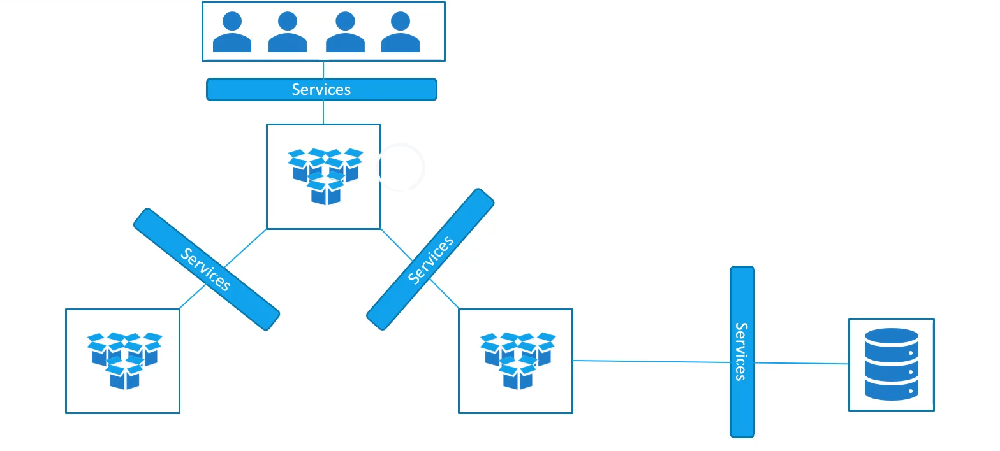
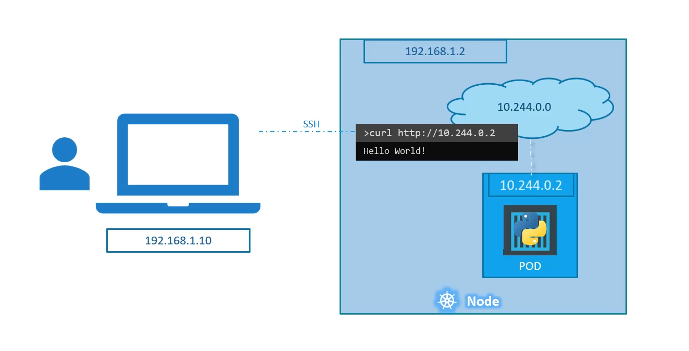
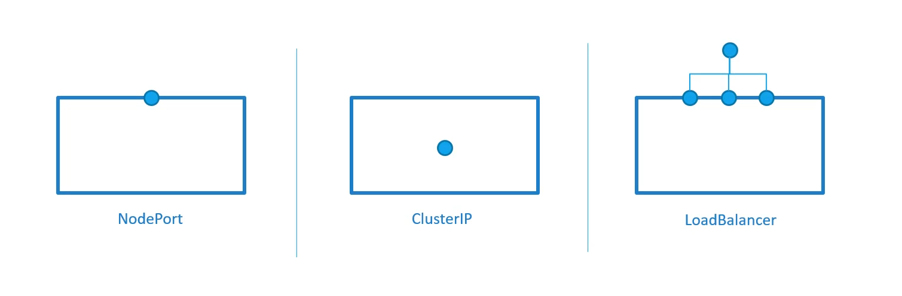
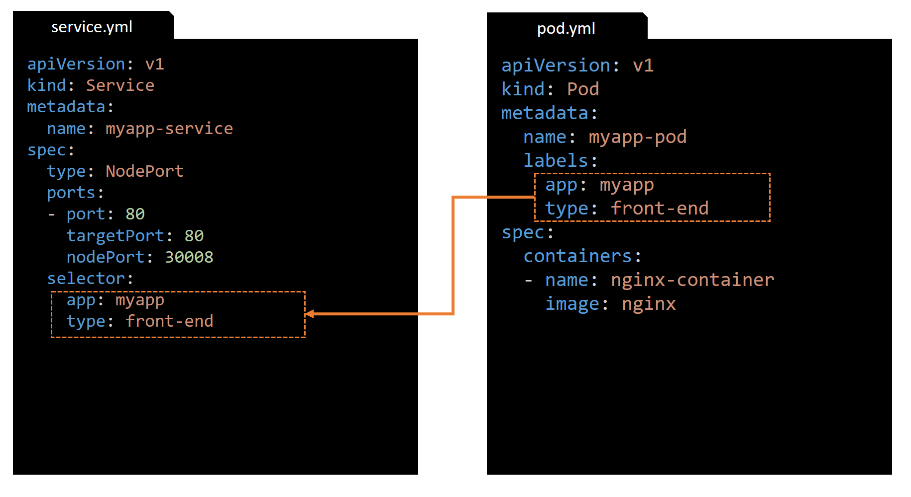

# Section 5 - Kubernetes Services

---

## Kubernetes Services - Overview
 - Kubernetes **Services** enable communication between various components within and outside the Kubernetes cluster 

> In this example  
> There a service that enables communication from the users (outside the cluster) to the front-end group of pods  
> There a service that enables communication from the front-end group of pods to the back-end group of pods
> There a service that enables communication from the back-end group of pods to an external application

---

## Kubernetes Services - simple network topology (1)

 - k8s Node IP = 192.168.1.2  
 - Client PC IP = 192.168.10  
 - Internal POD network = 10.244.0.0/16  
 - POD IP = 10.144.0.2 (serving a wep page on port 80)

> We cannot access the POD (10.144.0.2) directly from the client PC since they are two different networks  
---

## Kubernetes Services - access pods from within the k8s cluster

> Note that from within the k8s node we can access the web page directly, for example by executing `curl http://10.144.0.2` or if there is Desktop environment on the k8s node we could also use a browser also.

---
## Kubernetes Services - access pods from the outside world
 - The Kubernetes `Service` is an object (like Pod, ReplicaSet, Deployment etc..) that is created to enable network connectivity from the outside world to a Pod

> In this example the `Service` object listen to the port 30008 on the node and forwards request to the POD 10.144.0.2:80 
> This type of service os known as a `NodePort` service because the service listens to a port on the k8s node
---

## Service Types
 - ### `NodePort` => makes a pod accessible on a port of the node for access from the outside world

 - ### `ClusterIP` => In this case the service creates a virtual IP (and a DNS name) inside the cluster to enable communication between deferent applications inside the cluster (front-end pods accessing back-end pods)

 - ### `LoadBalancer` => provision an external load balancer in supported cloud providers 

---
## Service - NodePort (1)
 - We use the same example as above to describe in details the `NodePort` Service (access the Pod from the outside world)
 - The service is mapping a port on the node to a port on a pod

---
## Service - NodePort (2)

 - There are three ports involved:
   1. The port 80 on the pod where the actual web server is running, we refer to it as the `targetPort`, because that is where the service forwards the request to
   1. The port 80 on the service itself, we simple refer to it as the `port` of the service
   1. The port 30008 on the node which we use from the outside world to access the web server, we refer to it as the `nodePort`

> Note the terms `targetPort`, `port` and `nodePort` are from the viewpoint of the service
> The service il like a virtual server inside the node. It has its own IP address and that IP address is called the `ClusterIP` of the service
> The default range for the `nodePort` is [30000-32767]
---

## Service - NodePort - definition file (1)

---

## Service - NodePort - definition file (2)
 - The only mandatory field is `port`
 - If we do not specify a `targetPort` then it assumed to be the same as `port`
 - If we do not specify a `nodePort` then a free one from the valid range [30000-32767] will be automatically assign 
 - Note also that the `ports` value is an array which means that we can have multiple such entries 

## Service - NodePort - definition file (3) 
 - How to service is connected to the pod? 
 - As we did with the Deployment and ReplicaSet previously, we use a label `selector`
 - In the `selector` section we must specify a list of labels to identify the pod

