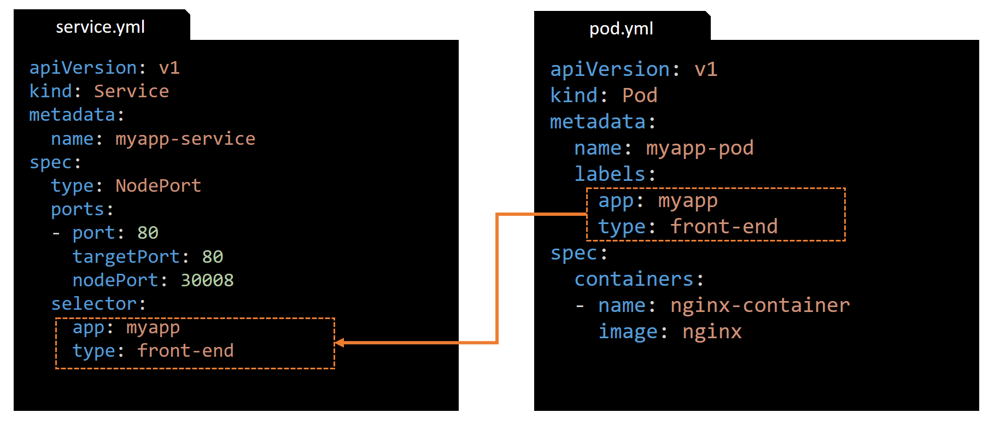
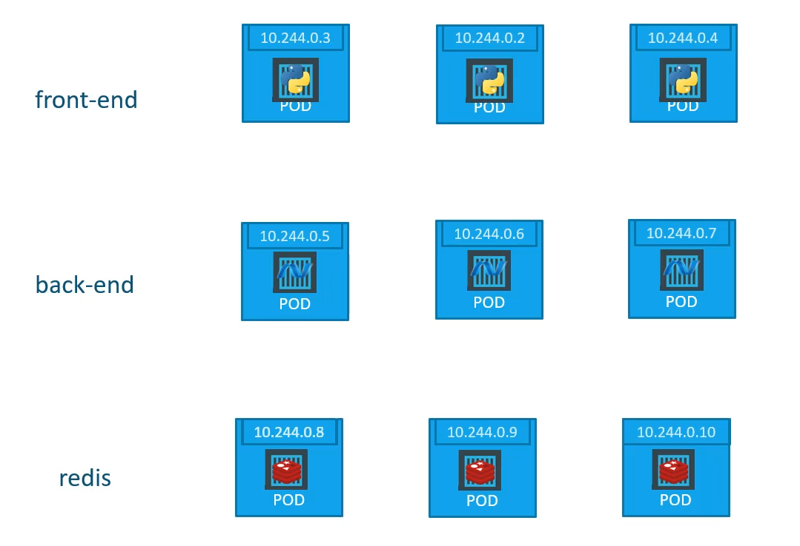
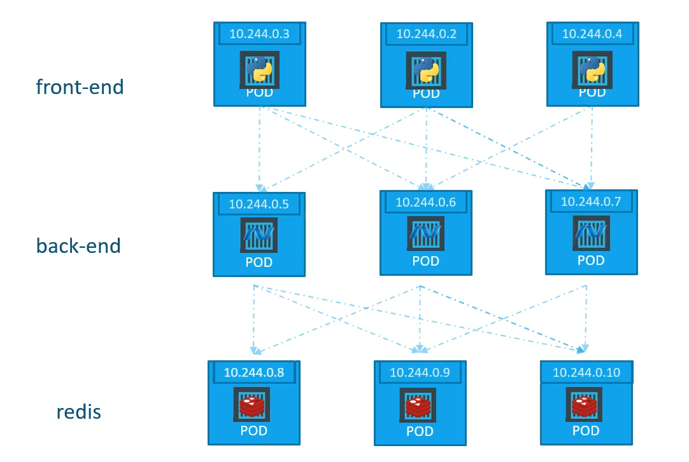
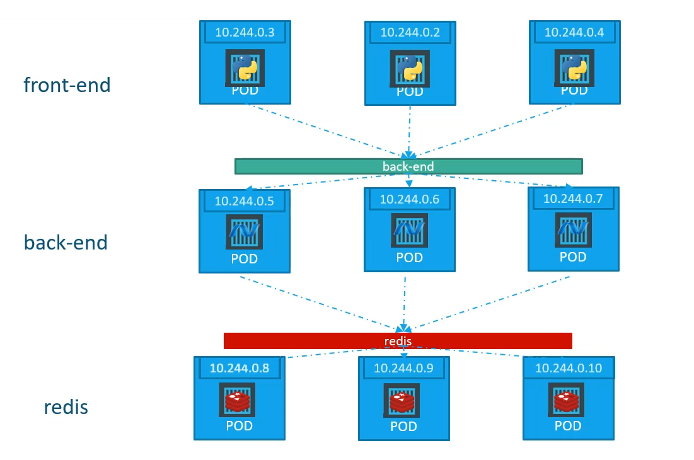
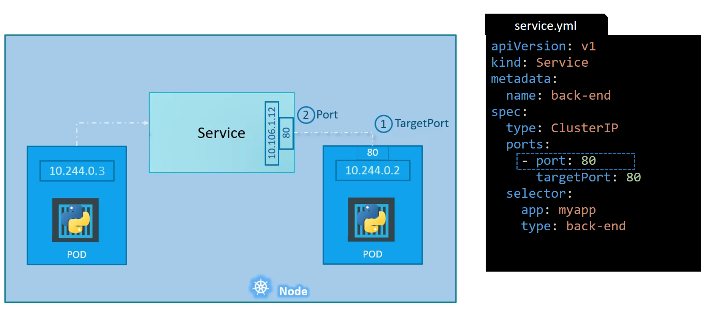

class: center, middle
# Section 6 
## Kubernetes Services
---


## Kubernetes Services - Overview (1)
 - Kubernetes **Services** enable communication between various components within and outside the Kubernetes cluster
 <br><br><br> 
 

---

## Kubernetes Services - Overview (2)
 - In this example  
 - There a service that enables communication from the users **(outside the cluster)** to the front-end group of pods
 - There a service that enables communication from the front-end group of pods to the back-end group of pods 
 - There a service that enables communication from the back-end group of pods to an external application

---

## Kubernetes Services - simple network topology (1)

---
## Kubernetes Services - simple network topology (2)

 - k8s Node IP = 192.168.1.2  
 - Client PC IP = 192.168.10  
 - Internal POD network = 10.244.0.0/16  
 - POD IP = 10.144.0.2 (serving a wep page on port 80)

> We cannot access the POD (10.144.0.2) directly from the client PC since they are two different networks  
---

## K8S Services - access pods from within the k8s cluster

> Note that from within the k8s node we can access the web page directly, for example by executing `curl http://10.144.0.2`

---
## K8S Services - access pods from the outside world (1)
 - The Kubernetes `Service` is an object (like Pod, ReplicaSet, Deployment etc..) that is created to enable network connectivity from the outside world to a Pod


---

## K8S Services - access pods from the outside world (2)
 - In this example the `Service` object listen to the port 30008 on the node and forwards request to the POD 10.144.0.2:80 
 - This type of service os known as a `NodePort` service because the service listens to a port on the k8s node

---

## Service Types
 - `NodePort` => makes a pod accessible on a port of the node for access from the outside world
 - `ClusterIP` => In this case the service creates a virtual IP (and a DNS name) inside the cluster to enable communication between deferent applications inside the cluster (front-end pods accessing back-end pods)
 - `LoadBalancer` => provision an external load balancer in supported cloud providers 


---
class: center, middle
# Section 6  
## Service - NodePort
---

## Service - NodePort (1)
 - The `NodePort` service is mapping a **port on the node** to a **port on a pod** (Ref: the above example)


---
## Service - NodePort (2)
 - There are three ports involved: the `targetPort`, the `port` and the `nodePort` <br> <br>


---

## Service - NodePort (3)
 - There are three ports involved:
   1. The port 80 on the pod where the actual web server is running, we refer to it as the `targetPort`, because that is where the service forwards the request to
   1. The port 80 on the service itself, we simple refer to it as the `port` of the service
   1. The port 30008 on the node which we use from the outside world to access the web server, we refer to it as the `nodePort`

> - Note the terms `targetPort`, `port` and `nodePort` are from the viewpoint of the service  
> - The service il like a virtual server inside the node. It has its own IP address and that IP address is called the `ClusterIP` of the service
> - The default range for the `nodePort` is [30000-32767]
---

## Service - NodePort - definition file (1)

---

## Service - NodePort - definition file (2)
 - The only mandatory field is `port`
 - If we do not specify a `targetPort` then it assumed to be the same as `port`
 - If we do not specify a `nodePort` then a free one from the valid range [30000-32767] will be automatically assign 
 - Note also that the `ports` value is an array which means that we can have multiple such entries
---
## Service - NodePort - definition file (3) 
 - How to service is connected to the pod? 
 

---

## Service - NodePort - definition file (4)
 - As we did with the Deployment and ReplicaSet previously, we use a label `selector`. 
 - In the `selector` section we must specify a list of labels to identify the pod  
    
---
## Service - NodePort - cmds (1)
 - To create the service use the `kubectl apply -f service.yml` command
```console
# kubectl apply -f service.yml
service/myapp-service created
```
 - To list the services use the `kubectl get services` command   

```console
# kubectl get services
NAME            TYPE        CLUSTER-IP      EXTERNAL-IP   PORT(S)        AGE
kubernetes      ClusterIP   10.96.0.1       <none>        443/TCP        57m
myapp-service   NodePort    10.105.47.242   <none>        80:30008/TCP   15m
```
> Note that the Service TYPE `NodePort`, the CLUSTER-IP 10.105.47.242 and the **80:30008** `<port>:<nodePort>` is displayed for the myapp-service
---
## Service - NodePort - cmds (2)
 - From the outside world we can use the IP address of the node to access the web server
```console
# curl http://192.168.1.2:30008
<!DOCTYPE html>
<html>
<head>
<title>Welcome to nginx!</title>
...
``` 
 - From within the cluster we can use the `ClusterIP` of the service to access the web server
```console
curl http://10.105.47.242:80
``` 
---
## Service - Multiple POD replicas (one node) - 1
 - The `Service` is also used when there are **Multiple POD replicas**, for example multiple instances of a web server
 

 
---
## Service - Multiple POD replicas (one node) - 2
 - In this case the `Service` is acting as a **Load Balancer** and will forward the request to the selected PODs via a round-robin algorithm
 - Note that all the POD replicas have all the same labels  
 

 
---
## Service - Multiple POD replicas (multiple nodes)
 - Also in case the PODs replicas are distributes across multiple nodes, the `Service` without any additional configuration is acting as **Load Balancer**  
 

---
## Service - (one pod - multiple nodes) 
 - Through the `Service` the POD is accessible from any node of the cluster
 - The `Service` is a cluster wide concept. It spans across all nodes of the cluster.  
 

---
## Service - (one pod - multiple nodes)  
<table>
  <tr>
    <td> 
      <ul>
        <li><code>curl 192.168.1.2:30008</code></li>
        <li><code>curl 192.168.1.3:30008</code></li>
        <li><code>curl 192.168.1.4:30008</code></li>
      </ul> 
    </td>
    <td></td>
  </tr>
</table>
 
---
class: center, middle
# Section 6  
## Service - ClusterIP
---
 
## Service - ClusterIP (1)
 - A full stack web application typically has different kinds of pods hosting different parts of an application
 - In this example we have a number of pods (replicas) for the **front-end** stack, the **back-end** stack and the key-value store DB  
 

---

## Service - ClusterIP (2)
 - The **fron-end** pods need to communicate with the *back-end* pods
 - The **back-end** pods need to communicate with the *redis* pods
  
---
## Service - ClusterIP (3)
 - What is the right way to establish connectivity between the various PODs of an application ?
 - We cannot relay on the POD IP addresses as they are not static, they may change if a POD is killed and a new one take place 
 - In this case the `Service` of type **ClusterIP** is the Solution  
 - The **ClusterIP** `Service` provides a **single network interface** and a **DNS name** to access the PODs replicas

---

## Service - ClusterIP (4) 
 - The `back-end` service is used from the *front-end* pods to access the *back-end* pods
 - The `redis` service is used from the *back-end* pods to access the *redis* pods  
 
---
## Service - ClusterIP (5) 
 - A **stable IP address** and a **name** **(DNS name)** is assign on each `Service`
 - The **name** of Service is used to access the PODs
 
---

## Service - ClusterIP - definition file (1)
 - The `targetPort` field is the port where the `back-end` PODs receive the request
 - The `port` field is the port of the Service which is acting as proxy and a Load Balancer for the back-end PODs
  
 
---
## Service - ClusterIP - definition file (2)
 - The only mandatory field is `port`
 - If we do not specify a `targetPort` then it assumed to be the same as `port`
 - The `type` is `ClusterIP`, we can omit it since it is the default type.
 - The `name` field is used to create a **DNS record (DNS name)**
 - The `front-end` PODs should use the **name** of the Service to access the `back-end` PODs

---

## Service - ClusterIP - definition file (2)
 - As before we use a `selector` to link the Service to the `back-end` PODs
 - In the `selector` section we must specify a list of labels to identify the pod


---

## Service - ClusterIP - cmds (1)
 - To create the service use the `kubectl apply -f service.yml` command
```console
# kubectl apply -f service.yml
service/back-end created
```

 - To list the services use the `kubectl get services` command
 ```console
# kubectl get services
NAME         TYPE        CLUSTER-IP      EXTERNAL-IP   PORT(S)   AGE
back-end     ClusterIP   10.107.102.56   <none>        80/TCP    2m2s
kubernetes   ClusterIP   10.96.0.1       <none>        443/TCP   36m
```

> The ClusterIP Service can be accessed from other PODS by using the IP address **10.107.102.56** or the name **back-end**

---

## Service - ClusterIP - cmds (2)
 - To see detailed information about a service use the `kubectl describe service <service-name>` command
```console
# kubectl describe service back-end 
Name:              back-end
Namespace:         default
Labels:            <none>
Annotations:       Selector:  app=myapp,type=back-end
Type:              ClusterIP
IP:                10.107.102.56
Port:              <unset>  80/TCP
TargetPort:        80/TCP
Endpoints:         10.244.1.3:80
Session Affinity:  None
Events:            <none>
```
---
## Service - ClusterIP - cmds (3)
 - From the output we can see: 
 - The `Endpoints` 10.244.1.3:80, which represent th IP addresses of the **healthy** PODs
 - The `Selector` **app=myapp,type=back-end**, which are the labels of the *back-end* PODs