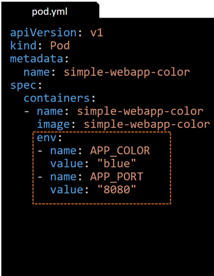

class: center, middle
# Section 7 
## Inject Data Into Applications
---

## CMD in Docker (1)
 - The default command `CMD` of the `ubuntu` Docker image is `/bin/bash`
 - `ubuntu` [Dockerfile](https://github.com/tianon/docker-brew-ubuntu-core/blob/dist-amd64/focal/Dockerfile)

```console
# docker run ubuntu
#
# docker ps
CONTAINER ID   IMAGE     COMMAND   CREATED   STATUS    PORTS     NAMES

# docker ps -a
CONTAINER ID   IMAGE     COMMAND       CREATED          STATUS                     PORTS     NAMES
d7618e9fcb86   ubuntu    "/bin/bash"   11 seconds ago   Exited (0) 9 seconds ago             
```

> The `docker run ubuntu` will exit immediately since the the default command `CMD` `/bin/bash` cannot find a terminal  
> Containers are meant to run a single application, the "main" application, which is defined by `CMD` in the Dockerfile  
> To attach a terminal we could use `docker run -it ubuntu`

---
## Override the "default" CMD with docker run
 - We can override the default CMD [application] by appending the name of the new command at the end of the `docker run` command
 - `docker run <image> <my-command>`
```console
$ docker run ubuntu sleep 5
...
will run the [sleep] application, will wait for 5 seconds and exits
...
```
---
## CMD in Dockerfile
 - We can override the default `CMD` **application** by build a new "custom" ubuntu Docker image
 
 - `CMD` - The [exec form](https://docs.docker.com/engine/reference/builder/#run) => use a JSON array ["command", "param1", "param2"]
 - **shell processing** does NOT take place, No variable substitution eg. `$HOME` 
```Dockerfile
FROM ubuntu
CMD ["sleep", "5"]
``` 

 - `CMD` - The [shell form](https://docs.docker.com/engine/reference/builder/#run) => the command is run in a shell
```Dockerfile
FROM ubuntu
CMD sleep 5
``` 
 - Build the custom image with `docker build` command
```console
$ docker build -f Dockerfile -t ubuntu-sleeper .
Sending build context to Docker daemon     47MB
Step 1/2 : FROM ubuntu
 ---> 7e0aa2d69a15
Step 2/2 : CMD ["sleep", "5"]
 ---> Using cache
 ---> aab3c242208c
Successfully built aab3c242208c
```
---

## ENTRYPOINT in Dockerfile
 - What if we would like to change the hardcoded sleep period from 5 seconds to 10 seconds
 - Even better, We would like just to specify the "sleeping period" parameter at run time
 - For this we need to use the `ENTRYPOINT` in the `Dockerfile`
```Dockerfile
FROM ubuntu
ENTRYPOINT ["sleep"]
```
 - This way we can run out ubuntu-sleeper with a custom parameter
```console
docker run ubuntu-sleeper 10 
```
> In this case the parameter *10* is appended to the `ENTRYPOINT` command `sleep`
> But if we do not specify a Integer parameter will NOT work, we will get an error

---
## CMD & ENTRYPOINT in Dockerfile
 - We can use both the `ENTRYPOINT` and the `CMD` in a `Dockerfile` to specify the mail application and a set of **default** startup parameters
```Dockerfile
FROM ubuntu
ENTRYPOINT ["sleep"]
CMD ["5"]
```
 - This way the Docker image has a **default** behavior (sleep 5 seconds) if we do NOT specify any parameter with the `docker run ubuntu-sleeper` command
 - We can easily override the **default** behavior (sleep 5 seconds) by appending a custom parameter after the `docker run ubuntu-sleeper` command

---
## Override the ENTRYPOINT with docker run
 - We can also override the `ENTRYPOINT` command at run time 
```
docker run --entrypoint sleep2.0 ubuntu-sleeper 10
``` 
> In this example we used an imaginary `sleep2.0` command 

---

## POD command & args
 - In the following example is a POD definition file for which we override both the `ENTRYPOINT` and the `CMD` of the docker image *ubuntu-sleeper*
```yml
apiVersion: v1
kind: Pod
metadata:
  name: ubuntu-sleeper-pod
spec:
  containers:
  - name: ubuntu-sleeper-container
    image: ubuntu-sleeper
    command: [sleep3.0]
    args: ["15"]
```
 - The `command` field is used to override the `ENTRYPOINT` of the Docker image
 - The `args` field is used to override the `CMD` of the Docker image 
 - Ref: [Define a Command and Arguments for a Container](https://kubernetes.io/docs/tasks/inject-data-application/define-command-argument-container/)
---

## Inject Data Into Applications
 - There are 3 main ways to inject *Configuration Data* into an application
   1. Use **environment** variables
   2. Use command line **arguments** 
   3. Use configuration **files** (.yaml or .properties)  

> The most common way is inject data via environment variables  

---

## POD environment variable
<table>
  <tr>
    <td> 
      <ul>
        <li>To set an environment variable we use the <code class="remark-inline-code">env</code> property</li>
        <li>The <code class="remark-inline-code">env</code> value is an <b>array</b> of dictionaries</li>
        <li>Each element of the array has a <code class="remark-inline-code">name</code> and a <code class="remark-inline-code">value</code> property</li>
        <li>The <code class="remark-inline-code">name</code> is name of the environment variable made available in the **container**</li>
      </ul> 
    </td>
    <td></td>
  </tr>
</table>

---
## POD environment variable from ConfigMap/Secret 
 - There are other ways of setting the environment variables in containers 
 - We can use `ConfigMap` or `Secret` Kubernetes object  
    

---
## ConfigMap
 - 
