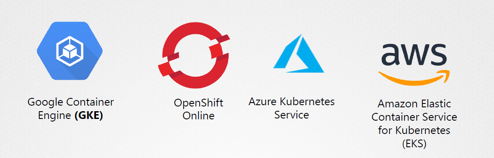

class: center, middle
# Section x - 
## Choosing the Right Container Infrastructure

---

## Kubernetes  
 - Kubernetes is **the most popular** container orchestrator. 
 - Released by Google in 2015. It's now maintained by an open source community that Google is a part of
 - Container runtimes **CRI plugin**
    - The Default **container runtime** was Docker (1.20)
    - The Default **container runtime** is *containerd*
    - Other container runtime can be used instead such as *CRI-O*  

---

## Options for running Kubernetes (1)
 ### 1. Cloud provider
 ### 2. Vendor *Distribution*
 ### 3. Manual Installation from packages
 
 - Kubernetes is **complex**, and **difficult** to set up and **configure**. 
 - Therefore, the best approach, is to use a solution that includes Kubernetes as a supported, maintained **component**    

---

## Options for running Kubernetes (Cloud provider)
 1. Cloud provider
    - Kubernetes is provided as a service. Each cloud provider has its own implementation of Kubernetes
    - Examples 
        - **AWS**  => EKS Amazon Elastic Kubernetes
        - **Azure** => AKS Azure Kubernetes Service
        - **GKE** => Google Container Engine

---

## Options for running Kubernetes (Vendor)
 2. Vendor *Distribution*
    - Most of the infrastructure vendors, that package their own Kubernetes *Distribution*
    - It is similar to the concept of **Linux distributions**
    - Can be "easily" installed on **private data centers**  
    - Examples
        - **Red Hat OpenShift**
        - **Docker Enterprise**
        - **Ubuntu Canonical**
        - **VMware Enterprise PKS**

---

## Options for running Kubernetes (Manual)
 3. Manual Installation from the *raw* GitHub upstream version Kubernetes
    - It is **complex** and **difficult** to set up and configure. 
    - It is generally recommended to **avoid** this type of installation unless you have a **dedicated team of experts**

---

## Why Kubernetes ?
 - It is important to understand if you really need to use an orchestrator and eventually which **type** of orchestration engine **(k8s - Swarm)** is best for your needs
 - Kubernetes is used very much from the industry but not always is the best **choice** 
 - Not every solution needs an orchestrator 
    - Some times **Docker** and **docker-compose** are enough
    
---
class: center, middle
# Thank you  
