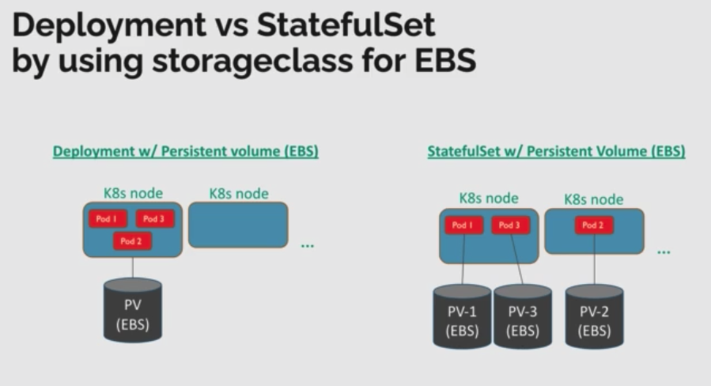

## persistent volume

 - In AWS EKS a persistent volume (PV) is implemented via an EBS volume, 
   which has to be declared as a _storage class_ first.
 - A stateful app can then request a volume, by specifying a _persistent volume claim_ 
   (PVC) and mount it in its corresponding pod.

## Notes
 - AWS EBS only supports ReadWriteOnce
 - AWS EFS supports ReadWriteMany



### By default the following StorageClass obj is created in EKS cluster

```yaml
apiVersion: storage.k8s.io/v1
kind: StorageClass
metadata:
  annotations:
    storageclass.kubernetes.io/is-default-class: "true"
  name: gp2
parameters:
  fsType: ext4
  type: gp2
provisioner: kubernetes.io/aws-ebs
reclaimPolicy: Delete
volumeBindingMode: WaitForFirstConsumer
```

### create namespace
to separate your cluster resources logically it is *best practice* to use _namespaces_. You can separate either by project, customer, team, environment,...
The benefit you gain is by getting control over resource qoutas, access control etc

2. define a persistent volume claim
```
kubectl create namespace ex10
kubectl apply -f 10-pvc.yaml --namespace=ns-eks-course
kubectl get pvc --namespace=ex10
```

## NOTE PVC not created until first pod claim it
The status of the PVC will be "WaitForFirstConsumer" on first create PVC. It's ok, just let it be. We can go with next lecturer Deploy MySQL backend video then. After we create pod, the volume is getting claimed automatically.

## deploy mysql
### create secret which stores mysql pw, to be injected as env var into container
```
kubectl create secret generic mysql-pass --from-literal=password=eks-course-mysql-pw --namespace=ns-eks-course
```


### launch mysql deployment
```
kubectl apply -f deploy-mysql.yaml --namespace=ns-eks-course
```
### checks
* persistent volumes
* persistent volume claims
* pods
```
kubectl get pv --namespace=ns-eks-course
kubectl get pvc --namespace=ns-eks-course
kubectl get pods -o wide --namespace=ns-eks-course
```
* EBS volumes
goto AWS mgm console => EC2 => Elastic Block store => volumes


## deploy wordpress
```
kubectl apply -f deploy-wordpress.yaml --namespace=ns-eks-course
```
get URL of the app:
```
kubectl describe service wordpress --namespace=ns-eks-course | grep Ingress
```
or goto AWS console => EC2

## cleanup
delete Wordpress _deployment_
```
kubectl delete -f deploy-wordpress-by-deployment.yaml --namespace=ns-eks-course
kubectl delete -f deploy-wordpress-by-statefulset.yaml --namespace=ns-eks-course
```

delete MySQL _deployment_
```
kubectl delete -f deploy-mysql.yaml --namespace=ns-eks-course
```

### delete EBS volumes  
 - Since we specified policy `retain` for the pv's, we have to delete them manually after deleting the pods, which had them in use.
 - For that go to AWS mgm console => EC2 => Volumes => select and delete the detached ones


