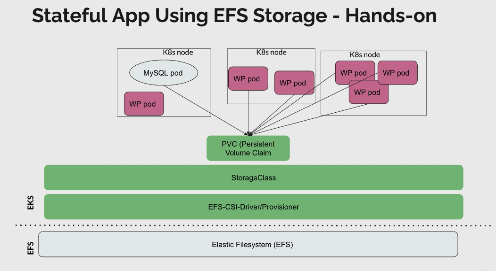

# EFS

## What is EFS
 - Managed NFS (network file system) that can be mounted on many EC2
 - EFS works with EC2 instances in multi-AZ
 - Highly available, scalable expensive (3xgp2), pay per use
 - We need a dedicated SG attached to the EFS that will allow EC2 instances to access

##  Enable EFS from AWS console
 - aws -> services -> EFS -> create file system
 - Select VPC (same as EKS), Availability->Regional -> Create
 - Press on created efs -> Network from here we can see:
   - Mount target ID = fsmt-0b59c601447db72cc
   - Subnet = subnet-0f9f1b8f1f1b8f1f1
   - Security group = sg-0f9f1b8f1f1b8f1f1
 - Select Manage to change the security group 

## amazon-efs-utils on worker nodes
 - probably not needed (if using EFS CSI driver) or (vm should already have it)
 - Install `amazon-efs-utils` on each worker node of the cluster
 - ssh -i <my-key.pem> ec2-user@<node-DNS-name> "sudo yum install -y " amazon-efs-utils

## EFS CSI driver - provisioner

 
## Install EFS-CSI-Driver/Provisioner via helm
 - `helm repo add aws-efs-csi-driver https://kubernetes-sigs.github.io/aws-efs-csi-driver`
 - `helm install aws-efs-csi-driver aws-efs-csi-driver/aws-efs-csi-driver`

## K8S application namespace side
 - Create namespace
 - Create StorageClass `provisioner: efs.csi-aws.com` (cannot find documentation on this)
   ```yaml
   kind: StorageClass
   apiVersion: storage.k8s.io/v1
   metadata:
     name: efs-sc
   provisioner: efs.csi.aws.com
   ```
 - Create RBAC `default` ServiceAccount -> `cluster-admin` ClusterRole 
 - Create PV with storageClassName 
```yaml
apiVersion: v1
kind: PersistentVolume
metadata:
  name: efs-pv
spec:
  capacity:
      storage: 5Gi
  volumeMode: Filesystem
  accessModes:
      - ReadWriteMany
  persistentVolumeReclaimPolicy: Retain
  storageClassName: efs-sc
  csi:
      driver: efs.csi.aws.com
      volumeHandle: fs-0b59c601447db72cc
```
     - Create PVC with storageClassName
```
 - Create PVC with storageClassName 

## K8S verify the mount
 - ssh into the worker node (pod using pvc)
 - `mount | grep csi`
 - ls /var/lib/kubelet/pods/xyz/volumes/...