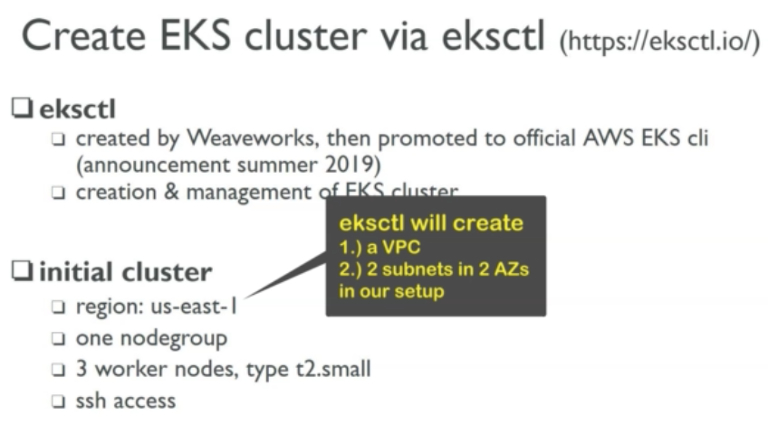
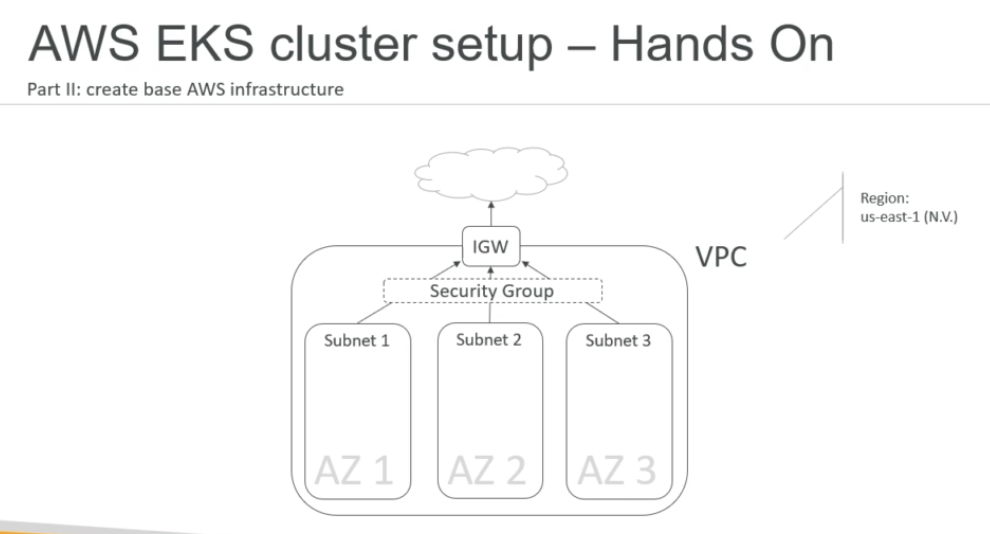

# AWS EKS legacy setup

## init-cluster ?
 - 

## create cluster vie eksctl
 - create cluster vie eksctl and yaml file
 - eksctl will create a VPC and subnets 
 - If we already have VPC and subnetd created upfront then
 - we can specify that in the eksctl yaml file
 - eksctl uses CloudFormation  
 - We can see the Stacks created in the CloudFormation
 - CloudFormation -> Stacks = Good point to start troubleshooting 

## Create AWS infrastructure (manually)
 - 
 - Creating all those resources and components manually by clicking through 
 - the AWS management console would be a very tedious and error prone work.
 - So to avoid that and to make it repeatable at any time, we are going to use cloud formation templates.
 - CloudFormation -> Create Stack -> local file [eks-course-vpc.yaml](eks-stef-course-files/eks-stef/c-EKS-Setup/c.b-DEPRECATED-manual-cloudformation/CloudFormation/eks-course-vpc.yaml)
 - Creat EKS cluster from AWS web console

 
